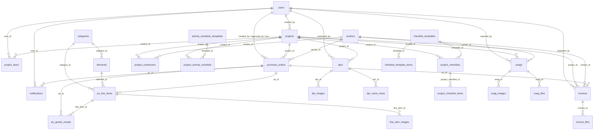
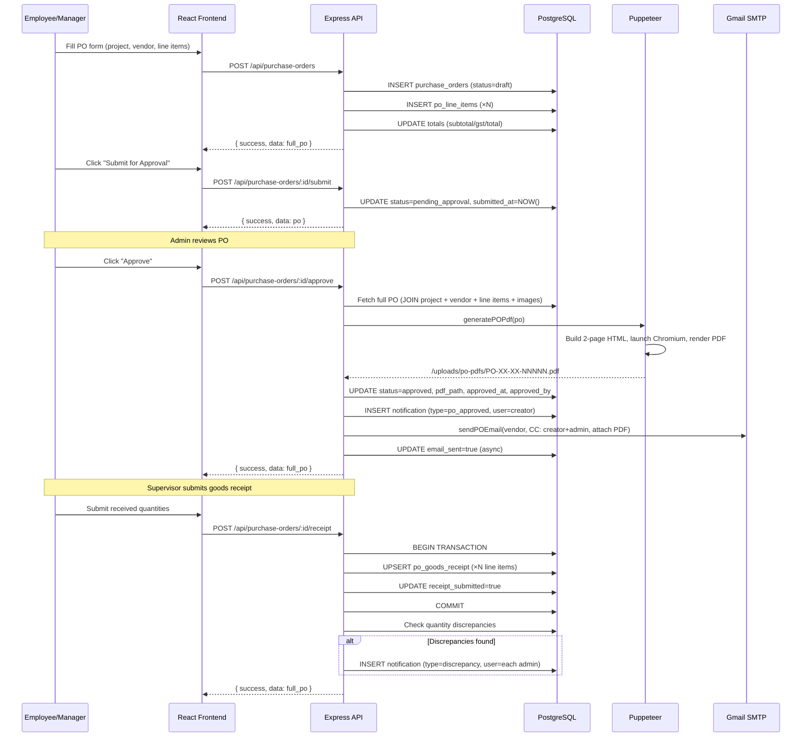
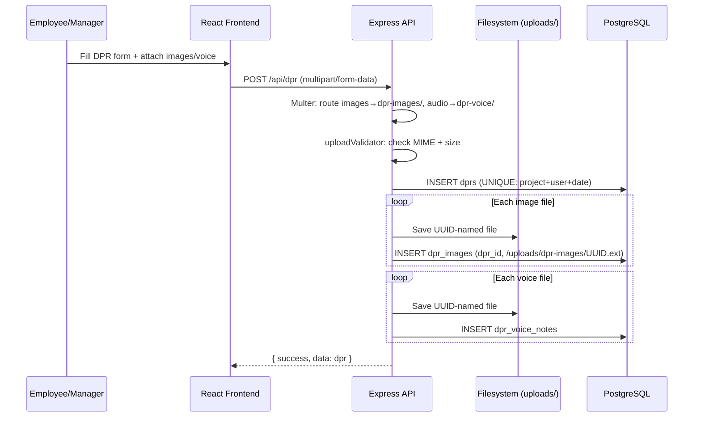
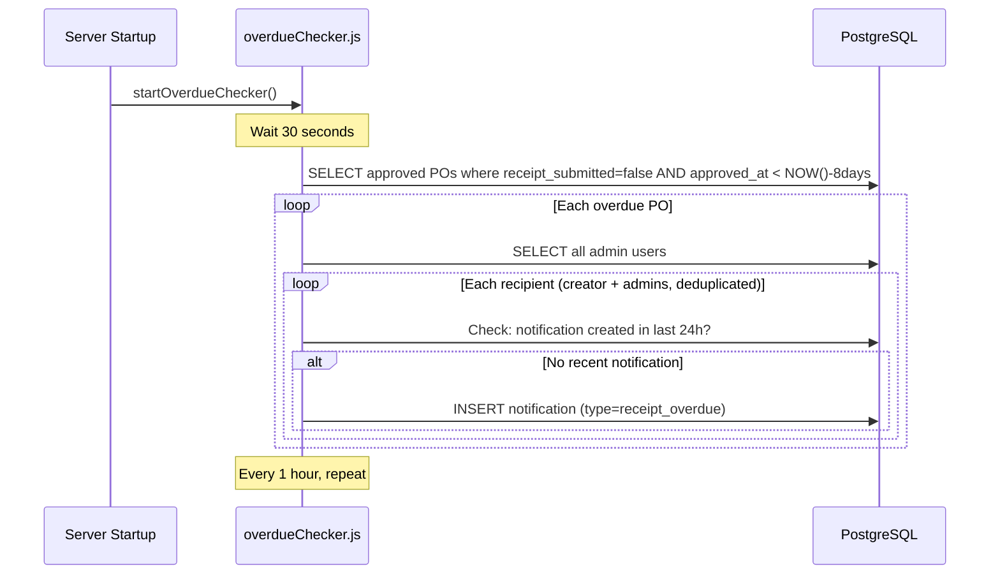
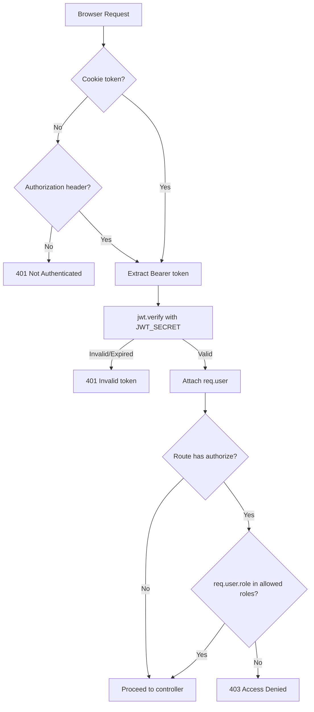
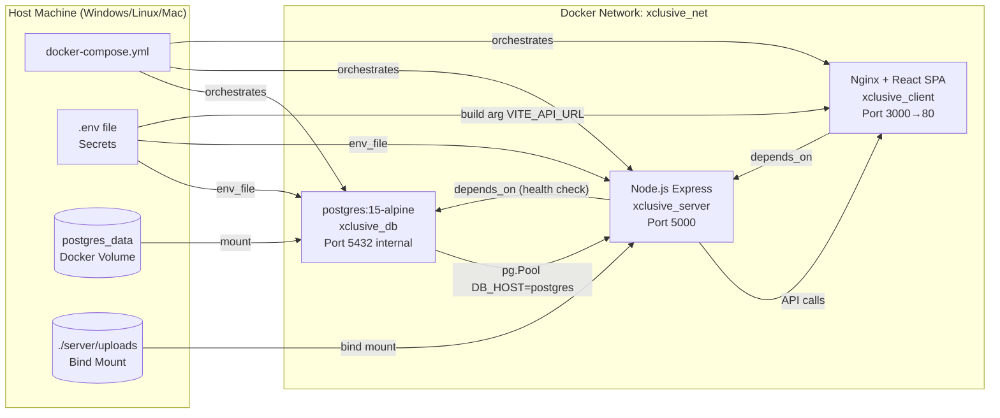

# Xclusive Interiors — Comprehensive Project Architecture & Documentation

> **Report Date:** 2026-04-15
> **Prepared by:** Automated Architectural Audit
> **Version:** 1.0
> **Classification:** Internal — Stakeholder Reference

---

## Table of Contents

1. [Executive Summary](#1-executive-summary)
2. [Tech Stack Overview](#2-tech-stack-overview)
3. [Directory Structure Map](#3-directory-structure-map)
4. [System Architecture Diagram](#4-system-architecture-diagram)
5. [File Analysis — Backend](#5-file-analysis--backend)
6. [File Analysis — Frontend](#6-file-analysis--frontend)
7. [Database Schema](#7-database-schema)
8. [API Endpoint Catalog](#8-api-endpoint-catalog)
9. [Data Flow Diagrams](#9-data-flow-diagrams)
10. [Security Architecture](#10-security-architecture)
11. [Deployment Architecture](#11-deployment-architecture)
12. [Third-Party Integrations](#12-third-party-integrations)
13. [Role & Permission Matrix](#13-role--permission-matrix)
14. [File Storage Architecture](#14-file-storage-architecture)
15. [Frontend Architecture](#15-frontend-architecture)
16. [Background Jobs & Automation](#16-background-jobs--automation)
17. [Known Design Decisions & Patterns](#17-known-design-decisions--patterns)

---

## 1. Executive Summary

**Xclusive Interiors PO & Project Management System** is a full-stack, containerised internal business management platform built for Xclusive Interiors Pvt. Ltd. (Pune, India). It digitises the company's end-to-end interior project workflow — from project creation and vendor management through purchase order approval, daily progress reporting, checklist tracking, snag logging, invoice management, and automated notifications.

The system is structured as a **React 18 SPA** (served via Nginx) communicating over REST with a **Node.js + Express.js** backend that persists data in **PostgreSQL 15**, all orchestrated by **Docker Compose** for WLAN-ready local deployment. The architecture follows a **modular monolith** pattern on the server: each business domain lives in its own folder (`modules/<domain>/`) with dedicated routes and controller files, all sharing a single PostgreSQL connection pool.

### Key Capabilities at a Glance

| Domain | Core Capability |
|---|---|
| Authentication | JWT via httpOnly cookie, 3-role RBAC |
| Projects | Full lifecycle management with team, contractors, and activity schedule |
| Purchase Orders | 4-state workflow (draft → pending → approved/rejected) with auto PDF + email |
| Vendors | Master with bank details, category filtering, bulk Excel import |
| Elements | 1,538-item master catalogue with category grouping, Excel import/export |
| DPR | Daily Progress Reports with photo and voice note uploads |
| Checklist | Template-based project checklists with per-item completion tracking |
| Snag List | Issue logging with attachments and admin review/resolution workflow |
| Invoices | File-based invoice tracking linked to projects/POs/vendors |
| Notifications | In-app bell notifications for PO events and overdue goods receipts |
| Activity Schedule | 405-template Gantt-style milestone tracker per project type |

---

## 2. Tech Stack Overview

| Layer | Technology | Version | Purpose |
|---|---|---|---|
| Frontend Framework | React | 18.2.0 | Component-based SPA |
| Build Tool | Vite | 5.0.8 | Fast dev server & production bundler |
| Styling | Tailwind CSS | 3.3.6 | Utility-first CSS |
| UI Components | Radix UI (shadcn/ui) | Various | Accessible headless primitives |
| State Management | Zustand | 4.4.7 | Lightweight global store |
| Data Fetching | TanStack React Query | 5.0.0 | Server state / cache |
| HTTP Client | Axios | 1.6.2 | API calls with interceptors |
| Forms | React Hook Form | 7.48.2 | Form state + validation |
| Routing | React Router DOM | 6.20.1 | Client-side routing |
| Icons | Lucide React | 0.294.0 | Icon library |
| Backend Runtime | Node.js + Express | 4.18.2 | REST API server |
| Database | PostgreSQL | 15 (Alpine) | Primary data store |
| ORM / Query | `pg` (node-postgres) | 8.11.3 | Raw SQL with connection pool |
| Authentication | JSON Web Token | 9.0.2 | Stateless auth tokens |
| Password Hashing | bcryptjs | 2.4.3 | Secure password storage |
| PDF Generation | Puppeteer | 21.5.2 | HTML → PDF via headless Chromium |
| Email | Nodemailer | 6.9.7 | Gmail SMTP automated delivery |
| File Uploads | Multer | 1.4.5 | Multipart form data handling |
| Excel I/O | xlsx (SheetJS) | 0.18.5 | Import/export Excel files |
| Validation | express-validator | 7.0.1 | Input validation middleware |
| Rate Limiting | express-rate-limit | 7.5.1 | API abuse protection |
| Security Headers | Helmet | 7.1.0 | HTTP security headers |
| Cookie Handling | cookie-parser | 1.4.6 | JWT cookie parsing |
| HTTP Logging | Morgan | 1.10.0 | Request logging |
| UUID Generation | uuid | 9.0.1 | UUID v4 for file naming |
| Containerisation | Docker + Docker Compose | 3.8 | Full stack orchestration |
| Frontend Web Server | Nginx | (Alpine) | SPA serving + API reverse proxy |

---

## 3. Directory Structure Map

```
xclusive-interiors/                  ← Root of monorepo
│
├── docker-compose.yml               ← Orchestrates postgres, server, client
├── .env                             ← Runtime secrets (DB, JWT, Gmail, URLs)
├── .dockerignore
├── .gitignore
├── README.md
│
├── client/                          ← React 18 + Vite frontend
│   ├── Dockerfile                   ← Multi-stage: node build → nginx serve
│   ├── index.html                   ← SPA shell
│   ├── nginx.conf                   ← SPA routing + /api proxy to server:5000
│   ├── vite.config.js               ← Vite config with React plugin
│   ├── tailwind.config.js           ← Tailwind content paths
│   ├── postcss.config.js            ← PostCSS + autoprefixer
│   ├── package.json                 ← Frontend dependencies
│   └── src/
│       ├── main.jsx                 ← React DOM root (BrowserRouter)
│       ├── App.jsx                  ← Route tree (all pages declared here)
│       ├── index.css                ← Tailwind directives + CSS variables
│       ├── lib/
│       │   ├── api.js               ← Axios instance (baseURL + 401 interceptor)
│       │   └── utils.js             ← cn() utility (clsx + tailwind-merge)
│       ├── store/
│       │   ├── authStore.js         ← Zustand: user, login, logout, fetchMe
│       │   └── invoiceStore.js      ← Zustand: invoice CRUD + file management
│       ├── components/
│       │   ├── layout/
│       │   │   ├── AppLayout.jsx    ← Sidebar + topbar shell (responsive)
│       │   │   └── ProtectedRoute.jsx ← Auth guard wrapper
│       │   └── shared/
│       │       └── index.jsx        ← Shared UI: Button, Badge, Card, Modal, Input
│       └── pages/
│           ├── auth/LoginPage.jsx
│           ├── dashboard/DashboardPage.jsx
│           ├── projects/            ← List, Detail, Form
│           ├── purchase-orders/     ← List, Detail (approve/reject), Form
│           ├── vendors/             ← List, Form
│           ├── elements/            ← Master list + Excel import
│           ├── categories/          ← Admin category management
│           ├── dpr/                 ← List, Form, Detail
│           ├── checklist/           ← Project checklist with progress
│           ├── snaglist/            ← Log snags + admin review
│           ├── invoices/            ← Invoice tracking
│           ├── users/               ← User management
│           ├── notifications/       ← In-app notification center
│           └── profile/             ← Self-service profile + password change
│
└── server/                          ← Node.js + Express backend
    ├── Dockerfile                   ← node:18-alpine production image
    ├── index.js                     ← Express app bootstrap + route mounting
    ├── package.json                 ← Backend dependencies
    ├── config/
    │   └── db.js                    ← pg.Pool (max 20 connections)
    ├── middleware/
    │   ├── auth.js                  ← JWT verify → req.user
    │   ├── role.js                  ← authorize(...roles) factory
    │   ├── rateLimiter.js           ← 100 req / 15 min window
    │   └── uploadValidator.js       ← Post-multer MIME + size check
    ├── modules/
    │   ├── auth/                    ← login, logout, /me
    │   ├── users/                   ← CRUD, bulk import, password management
    │   ├── projects/                ← Projects + team + contractors + schedule
    │   ├── vendors/                 ← Vendors + categories + Excel import/export
    │   ├── categories/              ← Element category master
    │   ├── elements/                ← Elements master + Excel import/export
    │   ├── purchase-orders/         ← Full PO workflow + PDF + email + receipt
    │   ├── dpr/                     ← Daily Progress Reports + file uploads
    │   ├── checklist/               ← Template-based checklists
    │   ├── snaglist/                ← Snag logging + admin review
    │   ├── activity-schedule/       ← Schedule templates + project types
    │   ├── invoices/                ← Invoice CRUD + file attachments
    │   └── notifications/           ← In-app + overdue checker helper
    ├── utils/
    │   ├── pdf.js                   ← Puppeteer HTML→PDF builder
    │   ├── email.js                 ← Nodemailer Gmail sender
    │   ├── overdueChecker.js        ← Hourly cron for overdue PO receipts
    │   └── validate.js              ← express-validator result handler
    ├── uploads/                     ← Persistent file storage (Docker volume)
    │   ├── dpr-images/              ← Site photos from DPR submissions
    │   ├── dpr-voice/               ← Voice note recordings from DPR
    │   ├── po-pdfs/                 ← Auto-generated PO PDFs (on approval)
    │   ├── po-items/                ← Line item reference images
    │   ├── snag-images/             ← Snag issue photos
    │   ├── snag-files/              ← Snag supporting documents
    │   └── invoices/                ← Uploaded vendor invoice files
    └── db/
        └── migrations/
            ├── 001_init.sql         ← All core tables (20 tables)
            ├── 002_seed.sql         ← 1,538 elements + 405 activity templates
            ├── 003_patches.sql      ← Column additions to activity schedule
            ├── 004_snag_files.sql   ← snag_files table
            ├── 005_invoices.sql     ← invoices + invoice_files tables
            ├── 006_vendor_categories.sql ← vendor_categories table
            ├── 007_goods_receipt_notifications.sql ← po_goods_receipt + notifications + user pw tracking
            └── 008_line_item_images.sql ← line_item_images table
```

---

## 4. System Architecture Diagram

```mermaid
graph TB
    subgraph "Client Devices (LAN / WLAN)"
        B[Browser / Mobile Browser]
    end

    subgraph "Docker Network: xclusive_net"
        subgraph "client container :3000→80"
            N[Nginx]
            SPA[React 18 SPA\nVite build]
        end

        subgraph "server container :5000"
            EX[Express.js API\nindex.js]
            subgraph "Middleware Stack"
                HLM[Helmet\nSecurity Headers]
                CORS[CORS\nAllowlist]
                RL[Rate Limiter\n100 req/15min]
                AUTH[authenticate\nJWT Verify]
                ROLE[authorize\nRBAC]
                UPV[uploadValidator\nMIME+Size]
            end
            subgraph "Route Modules"
                AR[/api/auth]
                UR[/api/users]
                PR[/api/projects]
                VR[/api/vendors]
                CR[/api/categories]
                ER[/api/elements]
                POR[/api/purchase-orders]
                DPR[/api/dpr]
                CKR[/api/checklist]
                SLR[/api/snaglist]
                ACR[/api/activity-schedule]
                INR[/api/invoices]
                NTR[/api/notifications]
            end
            subgraph "Utilities"
                PDF[pdf.js\nPuppeteer PDF]
                EMAIL[email.js\nNodemailer]
                OC[overdueChecker.js\nSetInterval 1h]
            end
        end

        subgraph "postgres container"
            PG[(PostgreSQL 15\n20+ tables)]
        end

        subgraph "Persistent Volume"
            VOL[./server/uploads\nImages · PDFs · Audio · Excel]
        end
    end

    subgraph "External Services"
        GMAIL[Gmail SMTP\nsmtp.gmail.com:587]
        CHROM[Headless Chromium\n inside server container]
    end

    B -- "HTTP :3000" --> N
    N -- "static SPA" --> SPA
    N -- "proxy /api →" --> EX
    N -- "proxy /uploads →" --> EX
    EX -- "pg.Pool" --> PG
    EX -- "fs read/write" --> VOL
    PDF -- "launch" --> CHROM
    EMAIL -- "SMTP" --> GMAIL
    OC -- "queries" --> PG
    OC -- "INSERT notifications" --> PG
```

---

## 5. File Analysis — Backend

### `server/index.js` — Application Bootstrap

The Express application entry point. Responsibilities:
- Loads environment variables via `dotenv`
- Configures global middleware: `helmet`, `cors` (allowlist from `CLIENT_URL`), `rateLimiter` (on all `/api` routes), `morgan` (dev logging), `express.json`, `express.urlencoded`, `cookieParser`
- Mounts the static `/uploads` folder for direct file serving
- Registers all 13 route modules under `/api/*` prefixes
- Registers a global Express error handler
- Starts `http.listen` on `PORT` (default 5000)
- On startup, calls `startOverdueChecker()` (30-second delayed init, then hourly)

---

### `server/config/db.js` — Database Connection

Creates and exports a `pg.Pool` with max 20 connections, idle timeout 30s, connect timeout 2s. Exposes a `query(text, params)` wrapper and the raw `pool` (used for transaction management in goods receipt). Environment variables: `DB_HOST`, `DB_PORT`, `DB_USER`, `DB_PASSWORD`, `DB_NAME`.

---

### `server/middleware/auth.js` — JWT Authentication

Reads the JWT from `req.cookies.token` (primary) or `Authorization: Bearer <token>` header (fallback). Verifies against `JWT_SECRET`. On success, attaches decoded payload `{ id, role, name, email }` to `req.user`. Returns `401` on missing or invalid tokens.

---

### `server/middleware/role.js` — Role-Based Authorization

Factory function: `authorize(...roles)` returns Express middleware that checks `req.user.role` against the allowed roles array. Returns `403` if role is not permitted. Used throughout route files as inline guards.

---

### `server/middleware/rateLimiter.js` — API Rate Limiting

Configured at **100 requests per 15-minute sliding window** per IP using `express-rate-limit`. Applied globally to both `/api/auth` and `/api` routes in `index.js`. Standard RFC headers are included (`RateLimit-*`).

---

### `server/middleware/uploadValidator.js` — File Upload Validation

Post-Multer validation middleware. Collects all uploaded files from `req.file`, `req.files[]`, and `req.files[fieldName][]`. Validates each against configurable `maxSizeBytes` (default 5MB) and `allowedMimeTypes` (default: JPEG, PNG, PDF). Returns `400` on violation. Applied after Multer in all upload routes.

---

### `server/modules/auth/` — Authentication Module

**`auth.routes.js`**: Three routes — `POST /login`, `POST /logout`, `GET /me`. Login uses express-validator for basic email/password validation.

**`auth.controller.js`**: 
- `login`: Queries users by email (case-insensitive), verifies bcrypt password hash. On success, signs a JWT `{ id, role, name, email }` and sets an httpOnly cookie (`token`) with 7-day expiry. Cookie security: `secure: true` only if `NODE_ENV=production` AND `CLIENT_URL` is HTTPS.
- `logout`: Clears the `token` cookie.
- `me`: Returns the current user's profile from DB (not from token, to ensure freshness).

---

### `server/modules/users/` — User Management Module

**`users.routes.js`**: Full CRUD with `authenticate` guard on all routes. Role guards:
- List / Get One / Create / Update / Reset Password: `admin` or `manager`
- Toggle Active / Hard Delete: `admin` only
- Bulk Import / Template Download: `admin` or `manager`
- Self password change / Get Me: any authenticated user

**`users.controller.js`**: 
- `list/getMe/getOne`: SELECT queries exposing profile fields (never `password_hash`)
- `create`: bcrypt hash (cost 10), INSERT with RETURNING
- `update`: COALESCE-based partial update for name/email/role
- `resetPassword`: Admin-side unlimited password reset
- `changeOwnPassword`: One-time self-service change. Blocked for admins. Tracks `password_changed_by_user` flag and `password_changed_at` timestamp
- `toggleActive`: Flips `is_active` boolean
- `hardDelete`: Blocks self-deletion; hard DELETE
- `bulkImport`: Reads XLSX file (first sheet), hashes passwords, ON CONFLICT (email) DO NOTHING
- `downloadTemplate`: Returns an in-memory XLSX template buffer

---

### `server/modules/projects/` — Project Management Module

**`projects.routes.js`**: Full CRUD + sub-resources. Static routes (`/template/download`, `/import`) declared before `/:id` to prevent route shadowing.

**`projects.controller.js`**:
- `list`: Returns all projects with aggregate PO count and DPR count
- `getOne`: Returns full project graph — core fields + team members (JOINed users) + contractors + last 10 DPRs + all POs + checklists + snags
- `create/update`: Dynamic field-based INSERT/UPDATE
- `updateStatus`: PATCH for status changes only
- `hardDelete`: Blocked if linked POs exist (referential integrity guard)
- `addTeamMember / removeTeamMember`: Manages `project_team` join table (ON CONFLICT DO NOTHING)
- `upsertContractor`: ON CONFLICT (project_id, trade) DO UPDATE — one contractor per trade per project
- `getSchedule / updateScheduleItem`: Read and update `project_activity_schedule` items
- `generateSchedule`: Bulk-insert activity rows from `activity_schedule_templates` filtered by project_type; clears existing schedule first
- `bulkImport / downloadTemplate`: Excel-based project bulk import

---

### `server/modules/vendors/` — Vendor Management Module

**`vendors.routes.js`**: All routes behind `authenticate`. Static sub-routes (`/categories`, `/export`, `/template/download`, `/import`) before `/:id`.

**`vendors.controller.js`**:
- `ensureVendorCategories()`: Idempotent table creation helper (migration guard) + migrates existing vendor category strings into the `vendor_categories` table
- `listCategories / createCategory`: Manages the `vendor_categories` lookup table
- `validateCategory()`: Validates a category name against the lookup table before write
- `list / getOne`: getOne includes last 20 linked POs
- `create / update`: Validates category before write; supports all vendor fields including bank details
- `toggleActive / hardDelete`: hardDelete blocked if linked POs exist
- `bulkImport`: Validates categories per row; admin can auto-create unknown categories during import
- `downloadTemplate / exportExcel`: Import template and full export respectively

---

### `server/modules/categories/` — Element Category Master

Inline route handlers (no separate controller file). Admin-only writes, all-authenticated reads. Supports list (with optional `active=true` filter), create, update name, toggle active.

---

### `server/modules/elements/` — Elements Master

**`elements.controller.js`**:
- `list`: Supports `active`, `category_id`, and `search` query filters. JOINs category name
- `getOne / create / update / toggleActive`: Standard CRUD
- `importExcel`: Multi-sheet import — sheet name used as category fallback. Auto-upserts categories. ON CONFLICT DO NOTHING per element
- `exportExcel`: Full dump as XLSX download

---

### `server/modules/purchase-orders/` — Purchase Order Module

The most complex module. Handles the full PO lifecycle.

**`po.routes.js`**: Dependency-aware filtering endpoints, line-item image upload, full CRUD, workflow actions (submit, approve, reject), PDF download, goods receipt.

**`po.controller.js`**:

Category mapping constants (`ELEMENT_TO_VENDOR_CATEGORIES`, `VENDOR_TO_ELEMENT_CATEGORIES`) enable smart filtering: selecting an element category narrows vendor options and vice versa.

- `generatePoNumber()`: Format `PO/YY-YY+1/NNNNN` — queries last PO with matching prefix, increments serial
- `fetchFullPO(id)`: Master query joining PO + project + vendor + POC user + creator + submitter + line items (with goods receipt data and aggregated images)
- `getVendorsByElementCategory`: Filters vendor list by mapped category
- `getElementsByVendorCategory`: Filters elements list by mapped category
- `list`: Filterable by project_id, vendor_id, status, created_by
- `create`: Auto-generates PO number; POC logic: admin can select any user, others default to self; saves line items; recalculates totals
- `update`: Blocked if status is not `draft` (admin can edit `pending_approval`); replaces all line items if provided
- `submit`: `draft → pending_approval` — only creator can submit their own draft
- `approve`: Generates PDF via Puppeteer; updates status to `approved`; inserts `po_approved` notification for creator; sends email to vendor (CC to internal users); records `email_sent=true` asynchronously
- `reject`: `pending_approval → rejected` with admin comment; inserts `po_rejected` notification
- `downloadPdf`: Serves PDF from `/uploads/po-pdfs/` — only for `approved` POs
- `hardDelete`: Admin-only hard delete
- `submitGoodsReceipt`: Transactional upsert of receipt quantities per line item; validates that side notes are provided when received qty differs from PO qty; triggers discrepancy notifications to all admins if any quantities differ
- `uploadLineItemImages`: Uploads up to 5 images per line item (max 2MB each, JPEG/PNG/WEBP)

---

### `server/modules/dpr/` — Daily Progress Reports

Inline route handlers. Uses Multer disk storage with UUID filenames, routing audio files to `dpr-voice/` and images to `dpr-images/`. Accepts up to 10 images and 3 voice files per DPR.

- `GET /`: Role-scoped listing — employees see only their own DPRs
- `GET /:id`: Returns DPR with associated images and voice notes
- `POST /`: Creates DPR + inserts image/voice records
- `DELETE /:id`: Admin-only; cascade deletes associated media via FK

---

### `server/modules/checklist/` — Checklist Templates & Project Checklists

Two-tier system: admin-managed templates → project instances.

- `GET/POST /templates`: CRUD for checklist templates (admin-only create)
- `GET /templates/:id`: Template with ordered items
- `GET /project/:projectId`: All checklists for a project with items and completion details
- `POST /project/:projectId/assign`: Creates a `project_checklists` instance; copies template items into `project_checklist_items`
- `PATCH /items/:itemId`: Mark item complete/incomplete with completed_by and timestamp

---

### `server/modules/snaglist/` — Snag List

Inline route handlers with Multer disk storage. Routes images to `snag-images/`, documents to `snag-files/`.

- `GET /`: Role-scoped — employees see only their own snags; filterable by project_id and status
- `GET /:id`: Snag with images and file attachments
- `POST /`: Creates snag; supports up to 10 images + 5 documents per submission
- `PATCH /:id`: Admin/manager-only review — updates status, admin_note, vendor assignment, confirmation dates, resolution tracking
- `DELETE /:id`: Admin-only hard delete (FK cascade removes images/files)

---

### `server/modules/invoices/` — Invoice Management

**`invoices.routes.js`**: Multer disk storage to `uploads/invoices/`. Up to 20 files, 30MB each.

**`invoices.controller.js`**:
- `list`: Filterable by project_id, vendor_id, po_id; attaches files to each invoice
- `create`: Creates invoice record; saves uploaded files; returns full invoice with files
- `updateStatus`: Admin-only. Updates `approved` and `paid` boolean flags. Business rule: paid cannot be set true while approved is false
- `hardDelete`: Admin-only; cascade removes files
- `addFiles / deleteFile`: Manage files on existing invoices

---

### `server/modules/notifications/` — Notifications

Inline route handlers. Only pulls notifications for the authenticated user.

- `GET /`: Last 50 notifications with PO number and project name
- `GET /unread-count`: Unread count for bell icon badge
- `PATCH /:id/read`: Mark single notification read
- `PATCH /read-all`: Mark all read
- `POST /check-overdue`: Admin-triggered manual overdue check

**`checkOverdueReceipts()` helper** (exported for `overdueChecker.js`): Finds approved POs with no receipt submitted after 8 calendar days; creates `receipt_overdue` notifications for the PO creator and all admins; deduplicates within 24-hour window.

---

### `server/modules/activity-schedule/` — Activity Schedule

Read-only module for template data.

- `GET /templates`: Returns `activity_schedule_templates` filtered by `project_type`; ordered by `step_number`
- `GET /project-types`: Returns hardcoded list of 15 project types (2BHK → Commercial)

---

### `server/utils/pdf.js` — Puppeteer PDF Generator

`generatePOPdf(po)` builds a two-page A4 PDF:
- **Page 1**: Company header (from env vars), bill-to details, vendor details, category summary table with totals, POC info, payment/other terms, signature block
- **Page 2 (Annexure)**: Full line-items table (Element, Description, Category, UOM, Qty, Rate, Brand/Make, GST%, Total) with optional inline reference images (base64 embedded)

Puppeteer is launched with `--no-sandbox`, `--disable-setuid-sandbox`, `--disable-dev-shm-usage` flags for Docker Alpine compatibility. Output saved to `uploads/po-pdfs/<PO-number>.pdf`.

---

### `server/utils/email.js` — Nodemailer Email Sender

`sendPOEmail({ toEmails, ccEmails, po, pdfPath, internalOnly, approvedByName })` sends a structured HTML email with the PO PDF attached. 

- If vendor email exists: vendor is `To`, internal users (creator + approver) are `CC`
- If vendor email missing: internal fallback with warning banner
- Deduplicates To/CC lists
- Email body includes full PO details table + line items table

---

### `server/utils/overdueChecker.js` — Background Job

`startOverdueChecker()` is called once on server boot:
1. Runs `checkOverdueReceipts()` after a 30-second startup delay (allows DB to settle)
2. Schedules `setInterval` to re-run every hour (3,600,000ms)

Calls the exported `checkOverdueReceipts` function from the notifications module.

---

### `server/utils/validate.js` — Validation Result Handler

Simple helper that calls `validationResult(req)` from express-validator and returns a `422` response with the first validation error if any exist. Used as middleware in routes that define `body()` validators.

---

## 6. File Analysis — Frontend

### `client/src/main.jsx` — React Entry Point

Wraps the app in `BrowserRouter` (React Router) and renders `<App />` into `#root`. Imports global `index.css`.

---

### `client/src/App.jsx` — Route Tree

Declares all client-side routes using React Router v6 `<Routes>/<Route>`. Structure:
- Public: `/login`
- All other routes wrapped in `<ProtectedRoute>` → `<AppLayout>`
- Routes: `/dashboard`, `/projects/*`, `/purchase-orders/*`, `/vendors/*`, `/elements`, `/categories`, `/dpr/*`, `/invoices`, `/checklist`, `/snaglist`, `/users`, `/notifications`, `/profile`
- Wildcard `*` redirects to `/dashboard`

On mount, calls `fetchMe()` from `authStore` to re-hydrate session from the existing cookie.

---

### `client/src/lib/api.js` — Axios Instance

Creates a configured Axios instance:
- `baseURL`: `VITE_API_URL` env var or `/api` (relative, picked up by Nginx proxy)
- `withCredentials: true` — sends cookies on every request
- Response interceptor: auto-redirects to `/login` on any `401` (except if already on login page)

---

### `client/src/lib/utils.js` — Utility Function

Exports `cn(...inputs)`: combines `clsx` + `tailwind-merge` for conditional/merged Tailwind class names. Used throughout all UI components.

---

### `client/src/store/authStore.js` — Authentication State (Zustand)

Global auth store with:
- `user`, `isAuthenticated`, `loading`, `authChecked` state
- `login(email, password)`: POST `/auth/login`, updates store
- `fetchMe()`: GET `/auth/me`, called on App mount to rehydrate session from cookie
- `logout()`: POST `/auth/logout`, clears store, redirects to `/login`

---

### `client/src/store/invoiceStore.js` — Invoice State (Zustand)

Dedicated store for invoice data:
- `fetchInvoices(filters)`: GET with URL query params
- `createInvoice(formData)`: multipart/form-data POST, prepends to list
- `updateInvoiceStatus(id, payload)`: PUT for approved/paid toggles
- `deleteInvoice(id)`: DELETE, filters from local list
- `addFiles(id, formData)`: POST additional files to invoice
- `deleteFile(fileId, invoiceId)`: DELETE file, updates nested file array in store

---

### `client/src/components/layout/AppLayout.jsx` — App Shell

Provides the persistent layout: collapsible sidebar navigation with role-aware menu items, topbar with notifications bell and user avatar. Contains `<Outlet />` for page content. Responsive design handles both desktop and mobile viewports.

---

### `client/src/components/layout/ProtectedRoute.jsx` — Auth Guard

Reads `isAuthenticated` and `authChecked` from `authStore`. Redirects to `/login` if not authenticated after auth check resolves. Renders a loading state while `authChecked` is false (prevents flash of login page on page refresh).

---

### `client/src/components/shared/index.jsx` — Shared UI Components

Re-exports and wraps Radix UI primitives with Tailwind styling: `Button`, `Badge`, `Card`, `Input`, `Modal`/`Dialog`, `Select`, `Label`, `Toast`, `Tabs`, `Separator`, `Avatar`, `Switch`, `DropdownMenu`. These form the design system used across all pages.

---

### `client/nginx.conf` — Nginx Configuration

- Listens on port 80 inside the container
- `client_max_body_size 30M` — allows large file uploads
- `location /`: SPA fallback — all unknown routes serve `index.html`
- `location /api`: Reverse proxies all API calls to `http://server:5000` (Docker service DNS)
- `location /uploads`: Proxies static file requests to the backend server
- Gzip compression enabled for text/CSS/JSON/JS

---

## 7. Database Schema

The database comprises **22 tables** across 8 migration files. All primary keys are UUID (`gen_random_uuid()`), all timestamps are `TIMESTAMPTZ`.

### Entity Relationship Overview



### Table Reference

| # | Table | Key Columns | Notes |
|---|---|---|---|
| 1 | `users` | id, name, email, password_hash, role, is_active, password_changed_by_user | Roles: admin/manager/employee |
| 2 | `vendors` | id, name, contact_person, phone, email, address, category, gstin, pan, bank_* | Bank details for PO |
| 3 | `vendor_categories` | id, name, is_active | Lookup for vendor category dropdown |
| 4 | `categories` | id, name, is_active | Element categories master |
| 5 | `elements` | id, name, description, category_id, default_unit, gst_percent, brand_make, is_active | 1,538+ items seeded |
| 6 | `projects` | id, name, code, client_name, site_address, status, project_type, services_taken, team_lead_3d, team_lead_2d, start_date, end_date | code is UNIQUE |
| 7 | `project_team` | project_id, user_id | Many-to-many, UNIQUE(project_id, user_id) |
| 8 | `project_contractors` | project_id, trade, contractor_name, vendor_id, notes | UNIQUE(project_id, trade) — one contractor per trade |
| 9 | `activity_schedule_templates` | activity_no, milestone_name, phase, step_number, project_type, duration_days, dependency_condition | 405 rows seeded |
| 10 | `project_activity_schedule` | project_id, template_id, milestone_name, phase, planned/actual dates, status, duration_days | Statuses: pending/in_progress/completed/delayed |
| 11 | `purchase_orders` | id, po_number, project_id, vendor_id, created_by, order_poc_user_id, status, subtotal, gst_total, total, pdf_path, email_sent, receipt_submitted | Statuses: draft/pending_approval/approved/rejected |
| 12 | `po_line_items` | po_id, element_id, item_name, category_id, unit, quantity, rate, gst_percent, gst_amount, total, brand_make, is_custom, sort_order | Cascade delete on PO |
| 13 | `po_goods_receipt` | po_id, line_item_id, received_qty, side_note, submitted_by | UNIQUE(po_id, line_item_id) — upsert |
| 14 | `line_item_images` | line_item_id, image_url | Max 5 per line item |
| 15 | `dprs` | project_id, submitted_by, report_date, work_description, progress_summary, work_completed, issues_faced, material_used | UNIQUE(project_id, submitted_by, report_date) |
| 16 | `dpr_images` | dpr_id, file_url, file_name | Cascade delete on DPR |
| 17 | `dpr_voice_notes` | dpr_id, file_url, file_name | Cascade delete on DPR |
| 18 | `checklist_templates` | id, name, created_by | Admin-managed templates |
| 19 | `checklist_template_items` | template_id, task_name, sort_order | Cascade delete on template |
| 20 | `project_checklists` | project_id, template_id | Template instantiation |
| 21 | `project_checklist_items` | project_checklist_id, task_name, is_completed, completed_by, completed_at, sort_order | Cascade delete on checklist |
| 22 | `snags` | project_id, reported_by, area, item_name, description, status, vendor_id, date_of_confirmation, designer_name, admin_note, resolved_by | Statuses: open/in_review/resolved |
| 23 | `snag_images` | snag_id, file_url | Cascade delete on snag |
| 24 | `snag_files` | snag_id, file_url, file_name, file_type, file_size | Cascade delete on snag |
| 25 | `invoices` | project_id, po_id, vendor_id, uploaded_by, approved, paid | Optional links to project/PO/vendor |
| 26 | `invoice_files` | invoice_id, file_url, file_name, file_type, file_size | Cascade delete on invoice |
| 27 | `notifications` | user_id, type, title, body, po_id, is_read | Types: receipt_overdue/discrepancy/po_approved/po_rejected |

---

## 8. API Endpoint Catalog

All endpoints are prefixed with `/api`. All except `POST /auth/login` and `POST /auth/logout` require authentication (JWT cookie or Bearer header). Role column shows minimum required role; "any" means any authenticated user.

### Authentication — `/api/auth`

| Method | Path | Role | Description | Request Body | Response |
|---|---|---|---|---|---|
| POST | `/auth/login` | public | Login with email + password | `{ email, password }` | `{ success, user: { id, name, email, role } }` + sets `token` cookie |
| POST | `/auth/logout` | any | Clear auth cookie | — | `{ success, message }` |
| GET | `/auth/me` | any | Get current user from DB | — | `{ success, user: { id, name, email, role } }` |

### Users — `/api/users`

| Method | Path | Role | Description | Request Body | Response |
|---|---|---|---|---|---|
| GET | `/users` | admin/manager | List all users | — | `{ success, data: [user…] }` |
| GET | `/users/me` | any | Current user's full profile | — | `{ success, data: user }` |
| GET | `/users/:id` | admin/manager | Get one user by ID | — | `{ success, data: user }` |
| POST | `/users` | admin/manager | Create user | `{ name, email, password, role }` | `{ success, data: user }` |
| PUT | `/users/:id` | admin/manager | Update user | `{ name?, email?, role? }` | `{ success, data: user }` |
| PATCH | `/users/:id/reset-password` | admin/manager | Admin reset password | `{ password }` | `{ success, message }` |
| PATCH | `/users/me/change-password` | any (non-admin) | Self one-time change | `{ current_password, new_password }` | `{ success, message }` |
| PATCH | `/users/:id/toggle` | admin | Toggle is_active | — | `{ success, data: { id, name, is_active } }` |
| DELETE | `/users/:id` | admin | Hard delete user | — | `{ success, message }` |
| POST | `/users/import` | admin/manager | Bulk import from XLSX | `multipart: file (xlsx)` | `{ success, data: { created, skipped, errors } }` |
| GET | `/users/template/download` | admin/manager | Download import template | — | XLSX file download |

### Projects — `/api/projects`

| Method | Path | Role | Description | Request Body | Response |
|---|---|---|---|---|---|
| GET | `/projects` | any | List projects | `?status=` | `{ success, data: [project+counts…] }` |
| GET | `/projects/:id` | any | Full project detail | — | `{ success, data: { ...project, team, contractors, purchase_orders, dprs, checklists, snags } }` |
| POST | `/projects` | admin/manager | Create project | `{ name, code, client_name, site_address, location, status, project_type, services_taken, team_lead_3d, team_lead_2d, remarks, project_scope, start_date, end_date }` | `{ success, data: project }` |
| PUT | `/projects/:id` | admin/manager | Update project | (any subset of above) | `{ success, data: project }` |
| PATCH | `/projects/:id/status` | admin/manager | Update status only | `{ status }` | `{ success, data: { id, name, status } }` |
| DELETE | `/projects/:id` | admin | Hard delete | — | `{ success, message }` |
| POST | `/projects/:id/team` | admin/manager | Add team member | `{ user_id }` | `{ success }` |
| DELETE | `/projects/:id/team/:userId` | admin/manager | Remove team member | — | `{ success }` |
| POST | `/projects/:id/contractors` | admin/manager | Upsert contractor | `{ trade, contractor_name, vendor_id?, notes? }` | `{ success, data: contractor }` |
| DELETE | `/projects/:id/contractors/:cid` | admin/manager | Remove contractor | — | `{ success }` |
| GET | `/projects/:id/schedule` | any | Get activity schedule | — | `{ success, data: [schedule_item…] }` |
| PATCH | `/projects/:id/schedule/:sid` | any | Update schedule item | `{ actual_start_date?, actual_end_date?, status?, notes? }` | `{ success, data: item }` |
| POST | `/projects/:id/schedule/generate` | admin/manager | Generate from template | `{ project_type }` | `{ success, data: [items…] }` |
| POST | `/projects/import` | admin/manager | Bulk import from XLSX | `multipart: file (xlsx)` | `{ success, data: { created, skipped, errors } }` |
| GET | `/projects/template/download` | admin/manager | Download import template | — | XLSX file download |

### Vendors — `/api/vendors`

| Method | Path | Role | Description | Request Body | Response |
|---|---|---|---|---|---|
| GET | `/vendors` | any | List vendors | `?active=true` | `{ success, data: [vendor…] }` |
| GET | `/vendors/categories` | any | List vendor categories | `?active=true` | `{ success, data: [category…] }` |
| POST | `/vendors/categories` | admin | Create vendor category | `{ name }` | `{ success, data: category }` |
| GET | `/vendors/export` | admin/manager | Export all vendors as XLSX | — | XLSX download |
| GET | `/vendors/template/download` | admin/manager | Import template | — | XLSX download |
| POST | `/vendors/import` | admin/manager | Bulk import from XLSX | `multipart: file (xlsx)` | `{ success, data: { created, skipped, errors } }` |
| GET | `/vendors/:id` | any | Vendor detail + last 20 POs | — | `{ success, data: { ...vendor, purchase_orders } }` |
| POST | `/vendors` | admin/manager | Create vendor | `{ name, contact_person?, phone?, email?, address?, category?, gstin?, pan?, bank_* }` | `{ success, data: vendor }` |
| PUT | `/vendors/:id` | admin/manager | Update vendor | (any subset of above) | `{ success, data: vendor }` |
| PATCH | `/vendors/:id/toggle` | admin/manager | Toggle is_active | — | `{ success, data: { id, name, is_active } }` |
| DELETE | `/vendors/:id` | admin | Hard delete vendor | — | `{ success, message }` |

### Categories — `/api/categories`

| Method | Path | Role | Description | Request Body | Response |
|---|---|---|---|---|---|
| GET | `/categories` | any | List element categories | `?active=true` | `{ success, data: [category…] }` |
| POST | `/categories` | admin | Create element category | `{ name }` | `{ success, data: category }` |
| PUT | `/categories/:id` | admin | Update category name | `{ name }` | `{ success, data: category }` |
| PATCH | `/categories/:id/toggle` | admin | Toggle is_active | — | `{ success, data: category }` |

### Elements — `/api/elements`

| Method | Path | Role | Description | Request Body | Response |
|---|---|---|---|---|---|
| GET | `/elements` | any | List elements | `?active=true&category_id=&search=` | `{ success, data: [element+category_name…] }` |
| GET | `/elements/export` | admin/manager | Export all as XLSX | — | XLSX download |
| GET | `/elements/:id` | any | Get one element | — | `{ success, data: element }` |
| POST | `/elements` | admin/manager | Create element | `{ name, description?, category_id?, default_unit?, gst_percent?, brand_make? }` | `{ success, data: element }` |
| PUT | `/elements/:id` | admin/manager | Update element | (any subset of above) | `{ success, data: element }` |
| PATCH | `/elements/:id/toggle` | admin/manager | Toggle is_active | — | `{ success, data: { id, name, is_active } }` |
| POST | `/elements/import` | admin/manager | Bulk import from XLSX | `multipart: file (xlsx, multi-sheet)` | `{ success, data: { created, skipped, errors } }` |

### Purchase Orders — `/api/purchase-orders`

| Method | Path | Role | Description | Request Body | Response |
|---|---|---|---|---|---|
| GET | `/purchase-orders/vendors-by-category` | any | Filter vendors by element category | `?element_category=` | `{ success, data: [vendor…] }` |
| GET | `/purchase-orders/elements-by-category` | any | Filter elements by vendor category | `?vendor_category=` | `{ success, data: [element…] }` |
| POST | `/purchase-orders/line-items/:id/images` | any | Upload images to line item | `multipart: images[] (max 5, 2MB, JPEG/PNG/WEBP)` | `{ success, data: [image…] }` |
| GET | `/purchase-orders` | any | List POs | `?project_id=&vendor_id=&status=&created_by=` | `{ success, data: [po+names…] }` |
| GET | `/purchase-orders/:id` | any | Full PO detail | — | `{ success, data: full_po_with_line_items }` |
| POST | `/purchase-orders` | any | Create PO (draft) | `{ project_id, vendor_id, order_poc_user_id?, work_start_date?, work_end_date?, payment_terms?, other_terms?, line_items: [{element_id?, item_name, description?, category_id?, unit?, quantity, rate, gst_percent?, brand_make?, is_custom?}] }` | `{ success, data: full_po }` |
| PUT | `/purchase-orders/:id` | any* | Update PO | Same as create | `{ success, data: full_po }` |
| POST | `/purchase-orders/:id/submit` | any | Submit for approval | — | `{ success, data: po }` |
| POST | `/purchase-orders/:id/approve` | admin | Approve PO | — | `{ success, data: full_po }` |
| POST | `/purchase-orders/:id/reject` | admin | Reject PO | `{ comment? }` | `{ success, data: po }` |
| GET | `/purchase-orders/:id/pdf` | any | Download PO PDF | — | PDF file (approved only) |
| DELETE | `/purchase-orders/:id` | admin | Hard delete PO | — | `{ success, message }` |
| POST | `/purchase-orders/:id/receipt` | any | Submit goods receipt | `{ items: [{ line_item_id, received_qty, side_note? }] }` | `{ success, data: full_po }` |

> *Update is gated at controller level: draft POs by any user; pending_approval only by admin.

### DPR — `/api/dpr`

| Method | Path | Role | Description | Request Body | Response |
|---|---|---|---|---|---|
| GET | `/dpr` | any | List DPRs | `?project_id=&user_id=&date=` | `{ success, data: [dpr+names…] }` |
| GET | `/dpr/:id` | any | DPR detail + media | — | `{ success, data: { ...dpr, images, voice_notes } }` |
| POST | `/dpr` | any | Submit DPR | `multipart: project_id, report_date, work_description, progress_summary, work_completed, issues_faced, material_used, images[] (max 10), voice[] (max 3)` | `{ success, data: dpr }` |
| DELETE | `/dpr/:id` | admin | Delete DPR + media | — | `{ success, message }` |

### Checklist — `/api/checklist`

| Method | Path | Role | Description | Request Body | Response |
|---|---|---|---|---|---|
| GET | `/checklist/templates` | any | List templates | — | `{ success, data: [template…] }` |
| GET | `/checklist/templates/:id` | any | Template with items | — | `{ success, data: { ...template, items } }` |
| POST | `/checklist/templates` | admin | Create template | `{ name, items: [task_name…] }` | `{ success, data: template }` |
| GET | `/checklist/project/:projectId` | any | Project checklists | — | `{ success, data: [checklist+items…] }` |
| POST | `/checklist/project/:projectId/assign` | admin/manager | Assign template to project | `{ template_id }` | `{ success, data: checklist }` |
| PATCH | `/checklist/items/:itemId` | any | Toggle item completion | `{ is_completed }` | `{ success, data: item }` |

### Snag List — `/api/snaglist`

| Method | Path | Role | Description | Request Body | Response |
|---|---|---|---|---|---|
| GET | `/snaglist` | any | List snags | `?project_id=&status=` | `{ success, data: [snag+names…] }` |
| GET | `/snaglist/:id` | any | Snag detail + media | — | `{ success, data: { ...snag, images, files } }` |
| POST | `/snaglist` | any | Log new snag | `multipart: project_id, area, item_name, description, designer_name, images[] (max 10), files[] (max 5)` | `{ success, data: snag }` |
| PATCH | `/snaglist/:id` | admin/manager | Review snag | `{ status?, admin_note?, vendor_id?, date_of_confirmation?, date_of_material_supply? }` | `{ success, data: snag }` |
| DELETE | `/snaglist/:id` | admin | Delete snag | — | `{ success, message }` |

### Activity Schedule — `/api/activity-schedule`

| Method | Path | Role | Description | Request Body | Response |
|---|---|---|---|---|---|
| GET | `/activity-schedule/templates` | any | List schedule templates | `?project_type=` | `{ success, data: [template…] }` |
| GET | `/activity-schedule/project-types` | any | List valid project types | — | `{ success, data: [type…] }` |

### Invoices — `/api/invoices`

| Method | Path | Role | Description | Request Body | Response |
|---|---|---|---|---|---|
| GET | `/invoices` | any | List invoices | `?project_id=&vendor_id=&po_id=` | `{ success, data: [invoice+files…] }` |
| POST | `/invoices` | any | Create invoice | `multipart: project_id?, po_id?, vendor_id?, files[] (max 20, 30MB each)` | `{ success, data: invoice+files }` |
| PUT | `/invoices/:id` | admin | Update approval/payment | `{ approved?, paid? }` | `{ success, data: invoice+files }` |
| DELETE | `/invoices/:id` | admin | Delete invoice | — | `{ success, message }` |
| POST | `/invoices/:id/files` | any | Add files to invoice | `multipart: files[] (max 20, 30MB each)` | `{ success, data: invoice+files }` |
| DELETE | `/invoices/files/:fileId` | admin | Delete single file | — | `{ success, message }` |

### Notifications — `/api/notifications`

| Method | Path | Role | Description | Request Body | Response |
|---|---|---|---|---|---|
| GET | `/notifications` | any | Get user's notifications (last 50) | — | `{ success, data: [notification+po+project…] }` |
| GET | `/notifications/unread-count` | any | Unread count | — | `{ success, count: N }` |
| PATCH | `/notifications/:id/read` | any | Mark one as read | — | `{ success }` |
| PATCH | `/notifications/read-all` | any | Mark all as read | — | `{ success }` |
| POST | `/notifications/check-overdue` | admin | Trigger overdue check | — | `{ success, notified: N }` |

### Health — `/api/health`

| Method | Path | Role | Description |
|---|---|---|---|
| GET | `/health` | public | Server health check | Returns `{ status: 'ok', timestamp }` |

---

## 9. Data Flow Diagrams

### Purchase Order Approval Flow



### DPR Submission Flow



### Overdue Receipt Background Job



---

## 10. Security Architecture

### Authentication Flow



### Security Measures Summary

| Layer | Measure | Detail |
|---|---|---|
| HTTP Headers | Helmet.js | X-Frame-Options, X-Content-Type-Options, CSP, HSTS (production) |
| CORS | Origin allowlist | Only origins listed in `CLIENT_URL` env var allowed |
| Rate Limiting | express-rate-limit | 100 requests per 15-minute window per IP, applied to all `/api` routes |
| Authentication | JWT + httpOnly cookie | 7-day expiry; `secure: true` in production HTTPS; `sameSite: 'lax'` |
| Authorization | RBAC middleware | 3 roles (admin/manager/employee); `authorize(...roles)` factory applied per route |
| Password Storage | bcrypt | Cost factor 10 (~300ms); never returned in responses |
| File Upload | Multer + uploadValidator | MIME type whitelist + file size limits per endpoint |
| SQL | Parameterised queries | All DB queries use `$1, $2` placeholders via `pg` pool — no string interpolation |
| Input Validation | express-validator | Email format, required fields, enum values validated before controller |
| Self-deletion guard | Controller check | Users cannot delete their own account |
| PO edit lock | Controller check | Non-admin users cannot edit POs beyond `draft` status |
| Referential guards | Controller pre-checks | Cannot delete projects/vendors with linked POs |

---

## 11. Deployment Architecture



### Container Configuration

| Container | Image | Ports | Health Check | Restart |
|---|---|---|---|---|
| `xclusive_db` | `postgres:15-alpine` | 5432 (internal) | `pg_isready -U $DB_USER` every 5s | always |
| `xclusive_server` | Custom (node:18-alpine) | `5000:5000` | Depends on postgres healthy | always |
| `xclusive_client` | Custom (nginx:alpine) | `3000:80` | Depends on server running | always |

### Environment Variables

| Variable | Used By | Purpose |
|---|---|---|
| `DB_HOST` | server | PostgreSQL hostname (= `postgres` in Docker) |
| `DB_PORT` | server | PostgreSQL port (default 5432) |
| `DB_USER` | server + postgres | Database username |
| `DB_PASSWORD` | server + postgres | Database password |
| `DB_NAME` | server + postgres | Database name |
| `JWT_SECRET` | server | JWT signing key (min 32 chars recommended) |
| `JWT_EXPIRES_IN` | server | JWT expiry (default `7d`) |
| `GMAIL_USER` | server | Gmail account for outgoing email |
| `GMAIL_APP_PASSWORD` | server | Gmail App Password (16 chars, 2FA required) |
| `CLIENT_URL` | server | Comma-separated CORS allowlist |
| `VITE_API_URL` | client (build arg) | Backend API URL baked into the SPA at build time |
| `COMPANY_NAME` | server | Used in PDF header + email sender |
| `COMPANY_ADDRESS` | server | Used in PO PDF bill-to block |
| `COMPANY_GSTIN` | server | Used in PO PDF |
| `PUPPETEER_EXECUTABLE_PATH` | server | Override Chromium path (optional, auto-detected) |

---

## 12. Third-Party Integrations

### Gmail SMTP (Nodemailer)

- **Trigger**: Automatically invoked when a PO is approved
- **Configuration**: `service: 'gmail'` with `GMAIL_USER` + `GMAIL_APP_PASSWORD` (Google App Password — requires 2FA)
- **Email content**: HTML email with PO details table, line items table, and PDF attachment
- **Recipient logic**: Primary `To` is vendor email; internal users (creator + approver) in `CC`. If vendor has no email, internal fallback with banner warning
- **Failure mode**: Non-fatal — email failure is logged to console but does not roll back PO approval
- **Tracking**: `email_sent` flag updated on PO record after successful delivery

### Puppeteer / Headless Chromium

- **Trigger**: During PO approval workflow
- **Purpose**: Generates a 2-page A4 PDF matching Xclusive Interiors' standard PO format
- **Docker note**: Launched with `--no-sandbox --disable-setuid-sandbox --disable-dev-shm-usage --disable-gpu` for Alpine Linux compatibility
- **Image embedding**: Line item reference images are read from disk and embedded as base64 data URIs to ensure offline PDF rendering

### PostgreSQL (via node-postgres)

- **Connection**: Single `pg.Pool` with max 20 connections, shared across all modules
- **Transactions**: Used explicitly in goods receipt submission (`BEGIN/COMMIT/ROLLBACK` via `pool.connect()`)
- **Migrations**: Run as Docker init scripts (`/docker-entrypoint-initdb.d/`) — executed once on first container start

---

## 13. Role & Permission Matrix

| Feature | Employee | Manager | Admin |
|---|---|---|---|
| **Login / View dashboard** | ✅ | ✅ | ✅ |
| **View own profile + change password** | ✅ | ✅ | ✅ |
| **View projects** | ✅ | ✅ | ✅ |
| **Create/Edit projects** | ❌ | ✅ | ✅ |
| **Delete projects** | ❌ | ❌ | ✅ |
| **Manage project team/contractors** | ❌ | ✅ | ✅ |
| **Generate activity schedule** | ❌ | ✅ | ✅ |
| **View vendors** | ✅ | ✅ | ✅ |
| **Create/Edit vendors** | ❌ | ✅ | ✅ |
| **Delete vendors** | ❌ | ❌ | ✅ |
| **Import/Export vendors** | ❌ | ✅ | ✅ |
| **Manage vendor categories** | ❌ | ❌ | ✅ |
| **View elements** | ✅ | ✅ | ✅ |
| **Create/Edit elements** | ❌ | ✅ | ✅ |
| **Import/Export elements** | ❌ | ✅ | ✅ |
| **Manage element categories** | ❌ | ❌ | ✅ |
| **Create PO (draft)** | ✅ | ✅ | ✅ |
| **Submit PO for approval** | ✅ | ✅ | ✅ |
| **Edit PO (draft)** | ✅ | ✅ | ✅ |
| **Edit PO (pending_approval)** | ❌ | ❌ | ✅ |
| **Approve PO** | ❌ | ❌ | ✅ |
| **Reject PO** | ❌ | ❌ | ✅ |
| **Delete PO** | ❌ | ❌ | ✅ |
| **Download PO PDF** | ✅ | ✅ | ✅ |
| **Submit goods receipt** | ✅ | ✅ | ✅ |
| **Submit DPR** | ✅ | ✅ | ❌* |
| **View DPRs** | Own only | All | All |
| **Delete DPR** | ❌ | ❌ | ✅ |
| **Log snag** | ✅ | ✅ | ❌* |
| **View snags** | Own only | All | All |
| **Review/resolve snag** | ❌ | ✅ | ✅ |
| **Delete snag** | ❌ | ❌ | ✅ |
| **Manage checklist templates** | ❌ | ❌ | ✅ |
| **Assign checklist to project** | ❌ | ✅ | ✅ |
| **Complete checklist items** | ✅ | ✅ | ✅ |
| **Manage invoices** | ✅ (create) | ✅ (create) | ✅ (full) |
| **Approve/pay invoices** | ❌ | ❌ | ✅ |
| **Manage users** | ❌ | ✅ (create/edit) | ✅ (full) |
| **Delete users** | ❌ | ❌ | ✅ |
| **Toggle user active** | ❌ | ❌ | ✅ |
| **Import users** | ❌ | ✅ | ✅ |
| **Trigger overdue check** | ❌ | ❌ | ✅ |

> *Admins can view DPRs and snags but are blocked from submitting them (by design — separation of oversight and reporting roles).

---

## 14. File Storage Architecture

All uploaded files are stored on the local filesystem inside the `server/uploads/` directory, which is bind-mounted as a Docker volume (`./server/uploads:/app/uploads`), ensuring data persistence across container restarts.

```
server/uploads/
├── dpr-images/      ← Site progress photos (JPEG/PNG/WEBP, max 20MB)
├── dpr-voice/       ← Voice note recordings (MP3/WAV/OGG/WebM/AAC/3GPP, max 20MB)
├── po-pdfs/         ← Auto-generated PO PDFs (named: PO-YY-YY-NNNNN.pdf)
├── po-items/        ← Line item reference images (JPEG/PNG/WEBP, max 2MB, max 5 per item)
├── snag-images/     ← Snag issue photos (JPEG/PNG/WEBP/GIF, max 20MB, max 10 per snag)
├── snag-files/      ← Snag documents (PDF/Word/Excel, max 20MB, max 5 per snag)
└── invoices/        ← Vendor invoice files (any MIME accepted by Multer, max 30MB, max 20 per invoice)
```

**File naming**: All uploaded files are renamed to `UUID + original_extension` using `uuid.v4()`. This prevents collisions and avoids exposing original filenames in storage.

**URL scheme**: Files are served statically at `http://server:5000/uploads/<subdir>/<uuid.ext>` via `express.static`. Nginx proxies `/uploads` requests to the backend container. Stored paths in DB are relative (e.g., `/uploads/dpr-images/abc.jpg`).

---

## 15. Frontend Architecture

### State Management Strategy

| Data Type | Mechanism | Rationale |
|---|---|---|
| Authentication state | Zustand (`authStore`) | Needs to persist across navigation; minimal boilerplate |
| Invoice list | Zustand (`invoiceStore`) | Frequent CRUD operations benefit from local cache |
| Server data (projects, POs, vendors, etc.) | TanStack React Query | Automatic caching, refetch, and invalidation |
| Form state | React Hook Form | Uncontrolled forms with built-in validation |
| Local UI state | React `useState` | Modal open/close, tab selection, etc. |

### Routing Architecture

React Router v6 nested routes:
- All authenticated routes nested under `<ProtectedRoute>` (auth check)
- All app pages nested under `<AppLayout>` (sidebar + topbar shell)
- `ProtectedRoute` reads `authChecked` to avoid redirect flash on cookie-based session restore
- App-level `useEffect` calls `fetchMe()` on mount — restores session from httpOnly cookie

### API Communication Pattern

All API calls go through the shared Axios instance in `lib/api.js`:
- `baseURL` set to `VITE_API_URL` (build-time env var) or `/api` (relative — proxied by Nginx)
- `withCredentials: true` ensures JWT cookie is sent on every request
- Global 401 interceptor auto-redirects to `/login` for session expiry

### Build & Serving

- **Development**: `vite dev` — HMR on localhost:3000, proxy `/api` → `localhost:5000`
- **Production**: `vite build` → static assets → Nginx serves from `/usr/share/nginx/html`; Nginx proxies `/api` and `/uploads` to the backend container

---

## 16. Background Jobs & Automation

| Job | Mechanism | Frequency | Purpose |
|---|---|---|---|
| Overdue Receipt Check | `setInterval` (Node.js) | Every 1 hour + on startup (30s delay) | Notify creators and admins of approved POs with no goods receipt submitted after 8 calendar days |
| PO PDF Generation | Triggered on approval | Per-event | Generate 2-page A4 PDF via Puppeteer |
| PO Email Dispatch | Triggered on approval | Per-event (async) | Send PO PDF to vendor via Gmail SMTP |

No external job scheduler (cron daemon, Bull, Agenda) is used. The overdue checker runs in-process via `setInterval`.

---

## 17. Known Design Decisions & Patterns

| Decision | Implementation | Rationale |
|---|---|---|
| **Modular monolith** | `modules/<domain>/` folders | Keeps related code together without microservice complexity; single deployable unit |
| **Raw SQL over ORM** | `pg` pool with parameterised queries | Full control over queries; avoids ORM abstraction overhead; team familiarity |
| **httpOnly cookie auth** | `res.cookie('token', ...)` | Prevents XSS token theft vs. localStorage; `withCredentials` on Axios for CORS |
| **Dual token source** | Cookie + Bearer header fallback | Supports both browser (cookie) and API tool (header) usage |
| **UUID primary keys** | `gen_random_uuid()` | No sequential ID leakage; safe for distributed use |
| **COALESCE-based updates** | `SET field = COALESCE($1, field)` | Partial updates without requiring all fields; avoids separate PATCH/PUT logic |
| **Static route ordering** | e.g., `/template/download` before `/:id` | Prevents route shadowing in Express — static paths must precede parameterised ones |
| **ON CONFLICT DO NOTHING** | Bulk imports | Idempotent seeding; re-running won't duplicate data |
| **Referential integrity in controllers** | Count-check before DELETE | Protects data relationships without relying solely on FK constraints |
| **Async email, sync PDF** | `sendPOEmail().then(...)` in approve | PDF must complete before responding; email failure is non-fatal and shouldn't block approval |
| **Role scoping in list queries** | `WHERE submitted_by = req.user.id` for employees | Data isolation for employees without changing API surface area |
| **Vendor category cross-mapping** | Hardcoded `ELEMENT_TO_VENDOR_CATEGORIES` | Enables smart dependent dropdowns in PO form — selecting an element category filters compatible vendors |
| **One-time password change** | `password_changed_by_user` flag | Users can change their initial password once; subsequent resets must go through admin |
| **Notification deduplication** | 24-hour window check before INSERT | Prevents notification spam from hourly overdue checker |

---

*Document generated by automated architectural audit — Xclusive Interiors PO & Project Management System — April 2026*
